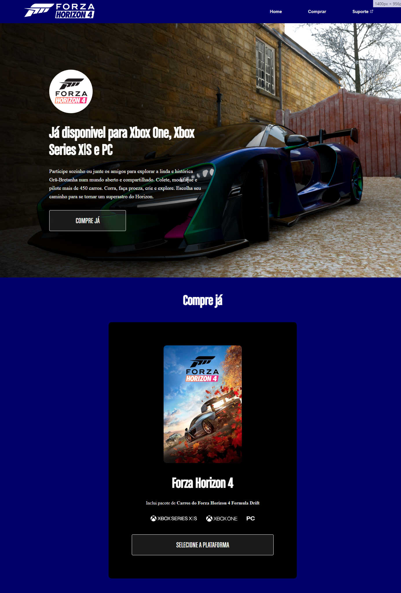
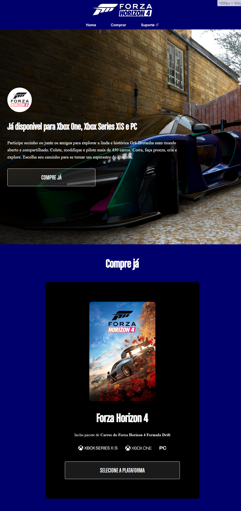
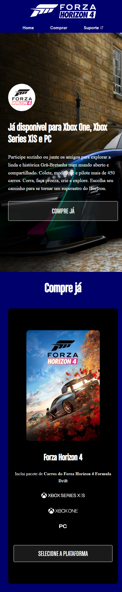

# Projeto Forza Horizon 4
- Projeto criado na Semana do Zero ao Programador contratado do mês de janeiro de 2024 com os gêmeos do Dev em Dobro.

## O site
- É um site landing page do jogo de corrida Forza Horizon 4 que mostra uma breve descrição do jogo e a opção de compra para as plataformas disponíveis.

## Prints
- Versão desktop

- Versão tablet

- Versão smartphone

## Link

- Live Site: (https://teoniuvilarinho.github.io/projeto-forza-horizon-4/)
